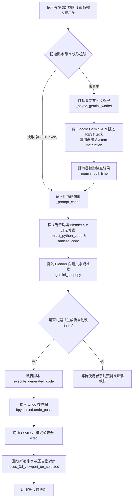

# Blender 5.1 Gemini Copilot 🚀

**Blender 5.1 Gemini Copilot** 是一款專為 Blender 5.x（向下相容 4.x）打造的次世代 AI 智慧建模外掛。透過整合 Google 最新一代 **Gemini 3.x API**，使用者只需輸入自然語言提示詞，AI 即可在背景即時生成專業、乾淨的 Blender Python（`bpy`）腳本並自動安全執行，實現「動口即建模」的流暢創作體驗。

---

## 🌟 核心特色 (Key Features)

- ⚡ **非同步背景生成（零卡頓）**  
  採用 `threading.Thread` + `bpy.app.timers` 非同步架構，向 Gemini API 發送請求時不會凍結 Blender 視窗，UI 操作依然絲滑順暢。
- 🛡️ **Blender 5.x 專屬相容性補丁 (Polyfills & Auto-Sanitizer)**  
  徹底解決大語言模型常見的舊版 API 幻覺！內建動態相容 Polyfill，並自動將舊語法（例如 `scene.objects.link` 自動升級為 `context.collection.objects.link`、`bpy.data.objects.new` 的 `mesh=` 修正為 `object_data=`）。
- 🎯 **純淨物件建模守則 (Pure Object Generation)**  
  專屬系統提示約束，嚴格禁止 AI 擅自清空場景（`bpy.ops.object.delete()`）或隨意加入巨型底板、多餘燈光，只精準生成您指定的物件。
- 🎥 **自動置中對焦與選取 (Auto Focus & Selection)**  
  物件生成後自動設定為 Active Object 並選取，同時平滑調整 3D 視圖鏡頭置中聚焦（`view_selected`），再也不用在無限場景中手動尋找新模型。
- ⏪ **完整 Undo 支援（Ctrl + Z 一鍵復原）**  
  在每次執行腳本前自動推入 `bpy.ops.ed.undo_push`，若生成成果不如預期，直接按下 `Ctrl + Z` 即可完美回退到執行前的乾淨場景。
- 💾 **工作階段快取與防爆冷卻機制**  
  同一次會話中重複請求相同提示詞時，直接自本地記憶體快取讀取（0 Token 消耗）；並配備 3 秒冷卻防護，避免頻繁點擊觸發 Google API 429 速率限制。
- 📦 **內建 0 Token 常用離線範本庫**  
  免聯網、免 API Key，隨選即用！包含「彩色方塊矩陣」、「攝影棚三點燈光與相機」、「一鍵清理幾何網格」、「PBR 黃金材質球」等實用範本。
- 📝 **文字編輯器無縫同步 (`gemini_script.py`)**  
  生成的代碼皆會自動清洗 Markdown 格式並同步寫入 Blender 內建文字編輯器，方便開發者手動微調、二次編程或直接另存新檔。
- 🚀 **支援最新 Gemini 3.x 系列模型**  
  預設支援 `gemini-3.6-flash`（官方推薦主力）、`gemini-3.5-flash-lite`（低延遲最省額度）、最新自動對齊版本，並支援自訂 Model ID。

---

## 🏗️ 系統架構與設計 (Architecture)

本外掛採用模組化、低耦合與非同步事件輪詢設計，整體工作流程如下：

### 核心模組職責拆解

| 模組 / 函式 | 核心功能說明 |
| :--- | :--- |
| `install_compatibility_polyfills()` | 為 Blender 執行期動態補上舊版 API 接口，消除因 LLM 訓練資料年代差異導致的崩潰。 |
| `sanitize_code_for_blender5()` | 正則過濾器，自動將已廢棄的參數（如 `mesh=`）與 Collection 鏈結語法升級為 5.x 標準。 |
| `_async_gemini_worker()` | 獨立背景線程，負責 JSON 打包、HTTP 呼叫與 HTTP 4xx/5xx 錯誤分流診斷。 |
| `_gemini_poll_timer()` | 主執行緒定時器（0.1s 輪詢），安全處理 Blender 內部 UI 更新與後續場景操作。 |
| `execute_generated_code()` | 封裝隔離環境執行代碼，管理 Undo 棧、主動物件鏈結與視圖鏡頭對焦。 |
| `VIEW3D_PT_gemini_copilot` | 整合於 3D Viewport N-Panel 的直覺式現代化面板。 |

---

## 💻 安裝指南 (Installation)

### 系統需求
- **Blender**: 5.1+ (亦相容於 Blender 4.0 ~ 5.0)
- **作業系統**: Windows / macOS / Linux
- **網路連線**: 需可存取 Google AI Studio API 服務
- **API 金鑰**: 免費取得 Google Gemini API Key

### 安裝步驟

#### 方式一：標準外掛安裝 (推薦)
1. 下載本專案的 `gemini_copilot.py`。
2. 將 `gemini_copilot.py` 壓縮為 `gemini_copilot.zip`（或者直接保留 `.py` 單檔）。
3. 開啟 Blender，進入頂部選單 **Edit (編輯) > Preferences (偏好設定)**。
4. 切換至 **Add-ons (外掛程式)** 標籤頁，點擊右上角下拉箭頭選擇 **Install from Disk (從磁碟安裝...)**。
5. 選擇檔案並勾選啟用 **Development: Gemini Blender Copilot**。

#### 方式二：直接在 Scripting 工作區執行
1. 在 Blender 中切換至頂部的 **Scripting (腳本編輯)** 標籤頁。
2. 點擊 **Open (開啟)** 並載入 `gemini_copilot.py`。
3. 點擊右上角 **Run Script (執行腳本)** 即可立即註冊外掛面板。

---

## 🔑 取得與設定 Google Gemini API Key

1. 前往 [Google AI Studio (aistudio.google.com)](https://aistudio.google.com/)。
2. 使用 Google 帳號登入並點選 **Get API key** 建立一組專屬的金鑰（提供免費額度）。
3. 回到 Blender，在 3D 視圖視窗按下鍵盤快捷鍵 `N` 展開側邊欄。
4. 切換至 **Gemini Copilot** 分頁。
5. 在 **API 配置** 區塊貼上您的 API Key，並點擊 **測試連線**。當狀態顯示綠色「連線成功」時即可開始使用！

---

## 📖 使用手冊 (Usage Guide)

### 1. 提示詞建模 (AI Prompting)
1. 在 **提示詞 (Prompt)** 輸入框中輸入你想建立的物體描述，支援繁簡中文、英文：
   - 範例 1：`建立一個金字塔，四個面賦予帶有微黃色的沙石材質`
   - 範例 2：`建立一個細分圓環體，套用霓虹發光材質`
   - 範例 3：`生成一組低多邊形 (Low-poly) 松樹模型`
2. 預設勾選 **「生成後自動執行」**，直接點擊 **【生成並執行腳本】**。
3. AI 生成完畢後，新物體將自動出現在場景中，視圖會即時對焦置中。
4. 若對生成成果不滿意，隨時按下鍵盤 `Ctrl + Z` 即可一秒復原！

### 2. 離線範本庫 (0 Token 免連線)
- 在 **常用離線範本** 下拉清單中挑選想要的效果（如彩色方塊陣列、攝影棚燈光相機等）。
- 點擊 **【載入範本】** 即可瞬間在場景中部署，完全免連線且不消耗任何 API 配額。

### 3. 手動預覽與二次微調
- 取消勾選 **「生成後自動執行」** 後再點擊生成，AI 生成的代碼將只會寫入 Blender 內建文字編輯器中的 `gemini_script.py`。
- 切換至 **Scripting** 工作區檢視代碼，修改完參數後點選面板上的 **【執行編輯器腳本】** 進行客製化執行。

### 4. 快捷輔助工具
- **視圖對焦物件**：一鍵將 3D 鏡頭置中對準當前選取的任何模型。
- **清除快取**：釋放當前工作階段儲存的所有歷史提示詞快取。

---

## ⚙️ 模型選擇與推薦設定

| 模型 ID | 特點說明 | 推薦使用場景 |
| :--- | :--- | :--- |
| `gemini-3.6-flash` | **官方主力推薦**：速度極快、推理能力強、代碼精準度高 | 預設首選，日常建模與複雜結構生成 |
| `gemini-3.5-flash-lite` | **超輕量極速**：延遲最低、配額消耗最少 | 輕量快速原型、API 額度受限時備用 |
| `gemini-flash-latest` | 自動指向 Google 最新的 Flash 發布版本 | 體驗 Google 最新動態功能 |
| `CUSTOM` | 手動輸入特定模型名稱 | 供開發者自行測試新發布或內部模型 |

> **建議參數設定**：
> - **溫度 (Temperature)**：建議保持在 `0.1` ~ `0.3` 之間，過高可能導致代碼語法不穩定。
> - **輸出 Token 上限**：建議設定為 `8192`（Gemini 3.x 含有內部思維鏈，足夠的 Token 可防止代碼截斷）。

---

## ❓ 常見問題與故障排除 (FAQ)

### Q1: 出現 `HTTP 429: Resource Exhausted` 錯誤？
- **原因**：短時間內發送了過多請求，超出了 Google AI Studio 免費層每分鐘請求上限（RPM）。
- **解決方案**：
  1. 請靜候 15~30 秒再試；
  2. 面板已內建 3 秒防爆冷卻；
  3. 可切換模型至 `gemini-3.5-flash-lite` 以減輕負載。

### Q2: 出現 `HTTP 404: Not Found`？
- **原因**：選取的模型 ID 在當前 API Key 所在地區尚未開放或名稱異動。
- **解決方案**：請切換回預設之官方主力推薦模型 `gemini-3.6-flash`。

### Q3: 物件生成了，但在 3D 視角中找不到？
- **原因**：可能場景過大或視角距離物件過遠。
- **解決方案**：外掛在執行完畢後會自動呼叫視圖對焦；您也可以隨時點選面板上的 **【視圖對焦物件】**（快捷鍵相當於數字鍵盤 `.`），視圖即會立即置中。

---

## 🔮 未來展望與路線圖 (Roadmap)

- [ ] **多輪對話與上下文感知 (Multi-turn Context)**
  - 支援對已選取物件進行增量編輯（例如：「將剛才建立的圓柱頂部向上擠出 2 個單位並縮小」）。
- [ ] **Multimodal 視圖視覺反饋 (Vision-assisted 3D)**
  - 自動擷取當前 Viewport 畫面並作為視覺輸入傳遞給 Gemini，讓 AI 親眼「看見」模型幾何外觀並進行細節修復。
- [ ] **Shader / 幾何節點專屬產生器 (Geometry Nodes Generator)**
  - 針對 Blender 5.x 節點系統提供自動連線與程序化生成節點組的專屬功能。
- [ ] **離線本機大模型支援 (Local LLM via Ollama / LM Studio)**
  - 支援連接本地運行的開源模型（如 DeepSeek-R1、Qwen-Coder、Llama 3）。
- [ ] **語音輸入直接控制 (Voice-to-3D)**
  - 整合語音轉文字功能，在建模時直接以語音指令控制場景物件。

---

## 📄 授權條款 (License)

本專案採用 [MIT License](LICENSE) 開源授權，歡迎自由修改、分發與商業整合。

---

## 🤝 貢獻與反饋 (Contributing)

歡迎提交 Issue 或 Pull Request 來協助改進本外掛！若有任何功能建議或使用疑問，請至 [GitHub Issues](https://github.com/Uyen666/blender5.1_copilot-Gemini-/issues) 提出。
